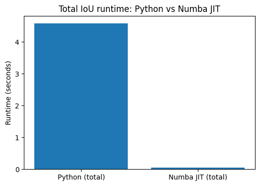
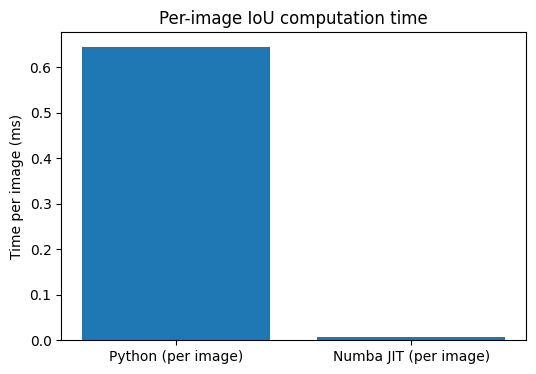
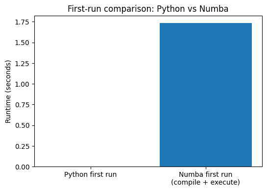

# Mini Project: High-Performance Computing and Computer Vision

# Track C: JIT Compilation

# Introduction

This project investigates the acceleration of a core computation in a computer vision pipeline.

YOLOv8 (Ultralytics implementation) is used to generate object detections on a traffic image dataset, from which bounding boxes are extracted. The focus is on computing pairwise Intersection over Union (IoU) between these boxes; this is a common operation in detection pipelines that is computationally expensive in pure Python due to nested loops.

A baseline Python implementation is compared with an optimized version using Numba JIT compilation.

The benchmark will include an analysis of the performance gains and trade-offs of applying JIT compilation to this workload.

The project also evaluates and confirms correctness of the optimized computation.

# Workload & Problem Definition

## Workload Definition

A traffic dataset containing 160 images from Hugging Face is used. Object detection using YOLOv8 inference is run on this dataset resulting in approximately 1300 bounding boxes in total.

The workload consists of computing pairwise Intersection over Union (IoU) for these detections.

- Dataset size: 160 images  
- Total detections: ~1300 bounding boxes  
- Average detections per image: ~8  

A single pass over this dataset was found to be insufficiently computationally intensive for reliable benchmarking. To address this, the workload is repeated multiple times over the same set of detections.

- Final configuration: **50 repeated passes** over the same detection set  
- This results in a baseline runtime of approximately 5 seconds  

The same detection data is reused across all repetitions to ensure identical inputs for both baseline and optimized implementations.

## Time complexity of pairwise IoU computation

* The pairwise IoU computation has O(N²) time complexity - since IoU is computed for all pairs of bounding boxes
* This quadratic growth means that the number of operations increases very quickly as the number of bounding boxes increases
* As a result of this computation can become a dominant performance bottleneck as the number of detections increases (e.g. in an urban setting or on highways)
* The JIT optimization does not change the algorithmic complexity, which is still O(N²), but the cost per operation is significantly reduced and results in substantial overall speedup.
* For example, increasing the number of bounding boxes from 10 to 20 results in approximately four times as many IoU computations (from 100 to 400).

## Implementations Compared

Two implementations are evaluated:

- **Baseline:** pure Python implementation using nested loops  
- **Optimized:** Numba JIT-compiled implementation using `@njit`

Both implementations compute the same IoU matrix for each image.

# Benchmark Methodology

## Timing Procedure

Execution time is measured using `time.perf_counter()`.

For each benchmark:

- The full repeated workload (all images × repetitions) is timed  
- Only the IoU computation is included in the measurement  
- Dataset loading, image saving, and YOLO inference are excluded  

## Warm-up and Compilation Handling

Numba performs Just-In-Time compilation on the first function call.

To ensure a fair comparison:

- A **warm-up call** is executed before timing the Numba implementation  
- The **first-call time (compile + execute)** is measured and reported separately 
- This excludes compilation overhead from the steady-state benchmark  

The Python implementation does not require warm-up, as it does not involve compilation.

## Metrics Reported

The following metrics are reported:

- Total execution time (Python vs Numba)  
- Per-image execution time  
- Speedup factor for steady-state and end-to-end
- Numba first-call time (compile + execute)  

These metrics provide both absolute and normalized views of performance.

## Hardware Environment

All experiments are executed in a Google Colab environment using a standard CPU configuration.

Using "!cat /proc/cpuinfo", "virtual_memory()" and "cpu_count()" (see Appendix > Hardware) I gathered:
* Intel(R) Xeon(R) CPU @ 2.20GHz
* Number of CPU's: 2
* RAM: ~1.8 GB used

(with inspiration from: https://saturncloud.io/blog/whats-the-hardware-spec-for-google-colaboratory/#2)

# Results

The Numba implementation achieves an approximately 88× steady-state speedup and a 2.57× end-to-end speedup when including compilation overhead.

## Python baseline
- Python baseline runtime: 4.5865 s (0.5957 ms/img)

## Steady-state
- Numba steady-state runtime: 0.0513 s  (0.0068 ms/img)
- Steady-state speedup: ~88×

## End-to-end
- Numba first-run time (compile + execute): 1.7363 s
- End-to-end speedup: 2.57x

# Correctness Validation

- The outputs of the Python baseline and Numba JIT implementations are compared  
- Equality is verified using `np.allclose` with a tolerance of `1e-6`  
- The maximum (worst-case) absolute difference across all outputs was 0.00000024 and the mean was 0.00000000.

# Discussion

The large speedup (~88×) is primarily due to the difference between Python’s interpreted execution model and Numba’s compiled execution. The baseline implementation relies on nested Python loops, which incur significant interpreter overhead and dynamic type handling at each iteration. Numba eliminates this overhead by compiling the function into optimized machine code with static typing, enabling much more efficient execution of the same operations.

It is important to note that this optimization does not change the algorithmic complexity of the computation. The pairwise IoU calculation remains O(N²), meaning that performance will still degrade rapidly as the number of bounding boxes increases. The observed speedup is therefore due to reduced cost per operation rather than a change in scaling behavior.

The reported speedup applies specifically to the IoU computation kernel. In a full object detection pipeline, where inference typically dominates runtime, the overall end-to-end speedup would be significantly smaller. However, inference itself can be substantially accelerated using GPU execution. These considerations highlight the importance of identifying and optimizing true performance bottlenecks within a system.

The workload is scaled through repeated passes over the same dataset. This approach ensures stable timing and a sufficiently large benchmark, but it is worth noting that the image dataset itself is relatively small (160 images).

## Limitations

- The dataset is relatively small (160 images), requiring repeated passes to create a sufficiently large workload.  
- The benchmark focuses on a custom IoU kernel rather than full object detection, so end-to-end performance gains would be smaller.  

# Conclusion

This project demonstrates that JIT compilation using Numba can significantly accelerate a computational kernel in a computer vision pipeline. The IoU computation achieved a steady-state speedup of approximately 88x while maintaining numerical correctness.

The results highlight the importance of targeting performance-critical kernels and show that even simple optimizations can yield substantial gains when applied to loop-heavy numerical workloads.